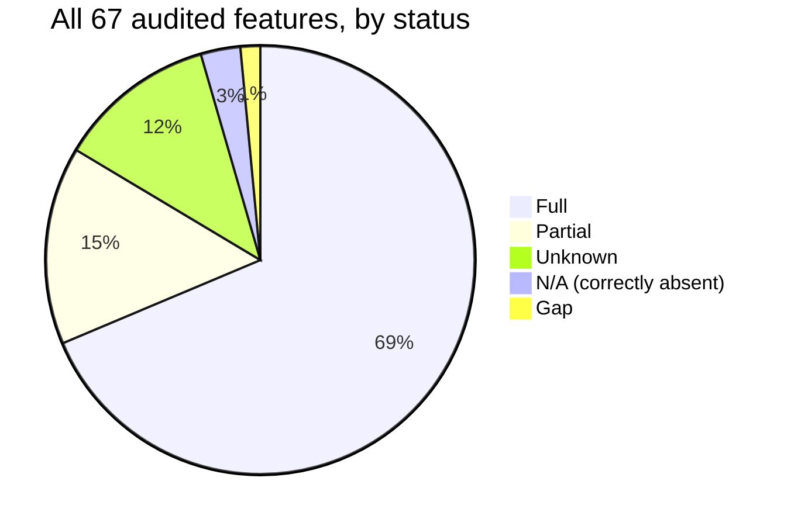

# MCP Python SDK v2 Conformance — Findings (v0)

Date: 2026-09-10

---
type: findings
topic: mcp_python_sdk_conformance
date: 2026-09-10
version: v0
prior-version: none
key-metric: full-conformance rate: 68.7 % of audited features (prior: N/A, delta: N/A)
decision-required: confirm
---

## Headline Result

metric: full-conformance rate (features rated Full ÷ features audited)
value: 68.7
unit: % (46 of 67 audited features)
prior: N/A
direction: new

## Results Tables

### Conformance by domain

| Domain | Full | Partial | Gap | N/A (correctly absent) | Unknown | Total |
|---|---|---|---|---|---|---|
| Base protocol & lifecycle | 11 | 1 | 0 | 0 | 1 | 13 |
| Transports & utilities | 11 | 1 | 0 | 2 | 0 | 14 |
| Server features (tools/resources/prompts) | 13 | 0 | 1 | 0 | 1 | 15 |
| Client features (sampling/roots/elicitation) | 7 | 2 | 0 | 0 | 1 | 10 |
| Authorization & security | 4 | 6 | 0 | 0 | 5 | 15 |
| **Total** | **46** | **10** | **1** | **2** | **8** | **67** |

### Flagged items requiring a build decision

| # | Item | Domain | Status | Why it matters for this build |
|---|---|---|---|---|
| 1 | Tasks extension (async/long-running tool execution) | Server | Gap | SDK's own source comment confirms types exist but every `tasks/*` method is deliberately excluded — no wire handlers at all |
| 2 | Token/credential storage | Auth | Partial | Ships only as a bare `TokenStorage` protocol + a non-persistent in-memory example; real storage is on the integrator |
| 3 | Security Best Practices doc (confused deputy, token passthrough, open redirect, SSRF, auth-URL scheme checks) | Auth | Unknown | No named class/function found enforcing any of these; treat as unimplemented until proven otherwise |
| 4 | Client ID Metadata Documents (CIMD) | Auth | Partial | Client-side support is real; no auth-server-side fetch-and-validate path was found for it |
| 5 | Default protocol-version inconsistency | Base | Unknown (flag) | `ClientSession.initialize()` offers 2025-11-25; docs describe the high-level `Client` as defaulting to 2026-07-28 — not reconciled from docs alone |
| 6 | RFC 9207 `iss` mix-up mitigation & exact redirect-URI match | Auth | Unknown | Both are 2026-07-28-specific additions; no code evidence found either way |
| 7 | Sampling & Roots deprecation | Client | Full (but deprecated) | Both still work against legacy servers but SEP-2577 deprecates them in this revision — don't build new functionality on top of either |
| 8 | Ping & JSON-RPC batching absence | Transport | N/A | Both were removed from the spec itself — the SDK not implementing them is conformance, not a shortfall |

## Observations

| Signal | Baseline / Expected | Observed [source] | Interpretation |
|---|---|---|---|
| Spec architecture | Prior revisions used a persistent handshake/session model | 2026-07-28 removes `initialize`, sessions, and server-initiated requests entirely, replacing them with `server/discover` + a stateless retry pattern (MRTR) [spec: modelcontextprotocol.io/specification/2026-07-28/basic/versioning] | This is a genuine SDK rewrite, not a relabeling — v2's `Client`, `server/discover` probe, and `InputRequiredResult` driver are real, non-trivial code, not just updated type stubs |
| Structured tool output | Spec allows an `outputSchema` on tool definitions | `result.structured_content` populated alongside `result.content`, exactly matching the outputSchema mechanism [docs/servers/structured-output.md] | Safe to rely on for typed tool returns in this build |
| Async tool execution | Rust SDK exposes a `task_support` execution hint for long-running tools | Python SDK defines the Tasks-extension types but wires none of the `tasks/*` methods [mcp_types/methods.py source comment] | If any planned tool needs to run past one request/response, this SDK gives no built-in mechanism — plan around it explicitly |
| OAuth mechanics vs. security posture | "Supports OAuth 2.1" is often read as covering the spec's Security Best Practices document too | PKCE, RFC 8707 resource binding, and bearer-token validation are code-backed; confused-deputy consent and token-passthrough guarding are not [security_best_practices tutorial pages] | These are two different claims — the SDK earning "Full" on OAuth mechanics says nothing about the Security Best Practices document |
| Self-reported vs. code evidence | SDK READMEs/roadmaps could plausibly overstate coverage | Across all five research passes, self-reported claims and code evidence were checked separately and no outright contradiction was found — gaps were self-disclosed in source comments (e.g. the Tasks-extension note), not hidden | The SDK's own documentation is trustworthy as a starting point here, which is not guaranteed for every dependency and shouldn't be assumed to hold for the next spec revision without re-checking |

## Charts & Visualizations

### Conformance rate by domain (Full only)

```
Base protocol      [###########################-----] 85%  (11/13)
Transports/utils    [########################----------] 79%  (11/14)
Server features    [###############################---] 87%  (13/15)
Client features     [#################-----------------] 70%  (7/10)
Authorization        [#########---------------------------] 27%  (4/15)
                    0%                                  100%
```
*One `#` per ~3 percentage points of features rated Full within that domain. Authorization is the clear outlier — not because OAuth mechanics are weak, but because the Security Best Practices document layered on top of OAuth in this revision has almost no confirmed enforcement.*



## Contradictions & Surprises

- Authorization mechanics score well (PKCE, RFC 8707, bearer validation all code-backed) while the adjacent Security Best Practices document scores almost entirely Unknown — the same domain contains both the SDK's strongest and weakest evidence.
- The SDK's own source comment on the Tasks extension self-disclosed the gap ("no wire handlers, session integration, or transport plumbing exists") rather than it being discovered by digging — worth noting as a point in the SDK's favor even though the gap itself is real.
- Two SDK code paths appear to disagree on the default protocol version offered during negotiation; this reads as an unresolved internal inconsistency rather than a documented dual-mode design, and was not resolvable from documentation alone.
- Ping and JSON-RPC batching being entirely absent looked at first glance like missing coverage, but both were removed from the spec itself — their absence is the correct, conformant behavior.

## Steering Questions

- [now] Confirm whether the hackathon build needs any tool call to run longer than one request/response — if yes, plan a custom mechanism now, since the Tasks extension gives none.
- [now] Confirm the auth surface actually in scope (OAuth login only, vs. proxying tokens to a third party) — the confused-deputy and token-passthrough gaps only matter if the build proxies to another service.
- [next run] Read `mcp/client/session.py` and the high-level `Client` wrapper directly to resolve the default-protocol-version inconsistency (item 5) before depending on either default.
- [next run] Spot-check `ClientSession.initialize()`'s per-request vs. once-at-handshake capability declaration against actual `tools/call` wire payloads — the matrix marks this Unknown from docs alone.
- [later] Re-run this audit against the Rust SDK (intentionally excluded from this pass) if the project pivots off Python, and again against the next spec revision once published.

## Pointers

- Full interactive matrix (filterable by domain/status, evidence per row): https://claude.ai/code/artifact/9f0a7e5b-c218-4eee-b765-d7b752741e50
- Local copy of the same artifact (open directly in a browser): [mcp-python-sdk-matrix.html](mcp-python-sdk-matrix.html)
- Spec under audit: https://modelcontextprotocol.io/specification/2026-07-28
- SDK under audit: `modelcontextprotocol/python-sdk` (via context7 documentation index)
